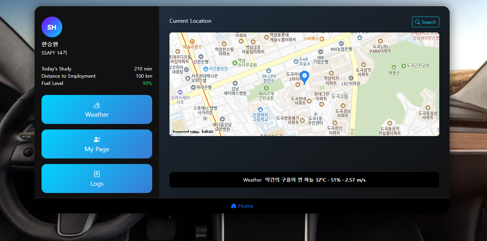
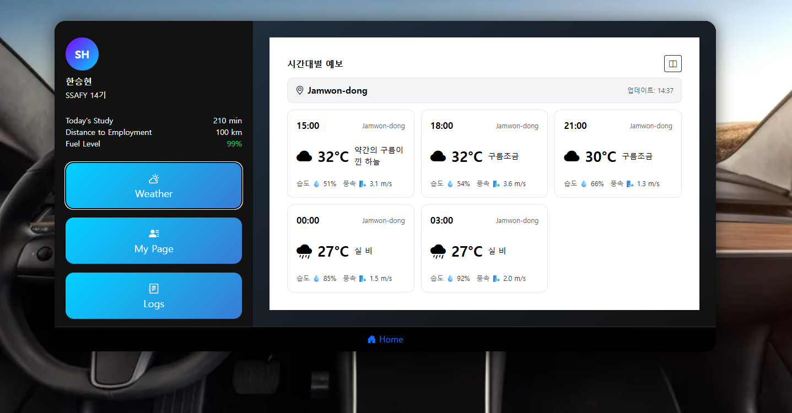
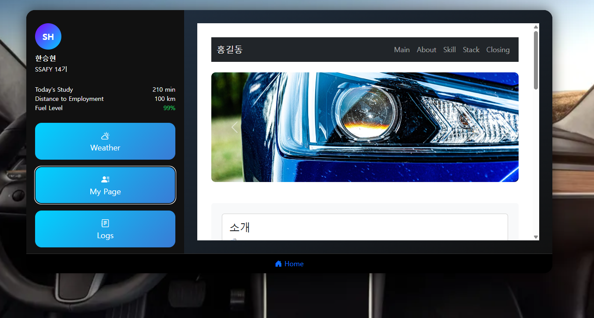
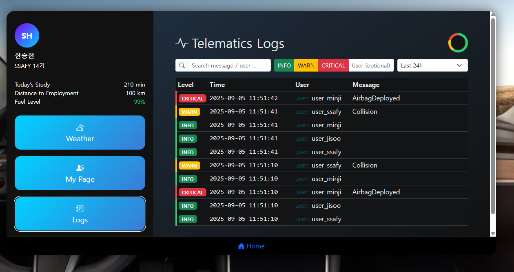

# Smart Dashboard

사용자 위치 기반 지도, 날씨 예보, 포트폴리오, 텔레매틱스 로그 조회, AI 챗봇을 하나의 태블릿형 UI에서 제공하는 웹 프로젝트입니다.

## 화면 구성

### Home — 지도 & 날씨 요약


### Weather — 시간대별 예보


### My Page — 포트폴리오


### Logs — 텔레매틱스 로그


## 주요 기능

- **Home**: Kakao Map 기반 장소 검색 및 경로 표시, 현재 위치 날씨 요약
- **Weather**: OpenWeatherMap API 기반 3시간 단위 예보 카드 (30분 자동 갱신)
- **My Page**: 자기소개, 기술 스택, 진행률 바 애니메이션
- **Logs**: Firestore `telematics_logs` 실시간 조회, 레벨/기간/키워드 필터
- **Chat**: OpenAI 기반 AI 챗봇, 최근 로그 컨텍스트 반영, 음성 입출력 지원

## 기술 스택

| 구분 | 사용 기술 |
|---|---|
| Frontend | HTML / CSS / JS ES Modules, Bootstrap, Kakao Maps API, OpenWeatherMap API, Firebase Firestore, Web Speech API |
| Backend | Node.js, Express, OpenAI SDK |

## 실행 방법

```bash
# 프론트엔드 (로컬 서버 필요)
python -m http.server 5500
# → http://localhost:5500/main.html

# 백엔드
cd backend && npm install
# .env에 OPENAI_API_KEY 입력 후
node server.js
```

## 담당자

| 학번 | 이름 |
|---|---|
| 1444820 | 성주희 |
| 1441050 | 한승현 |
